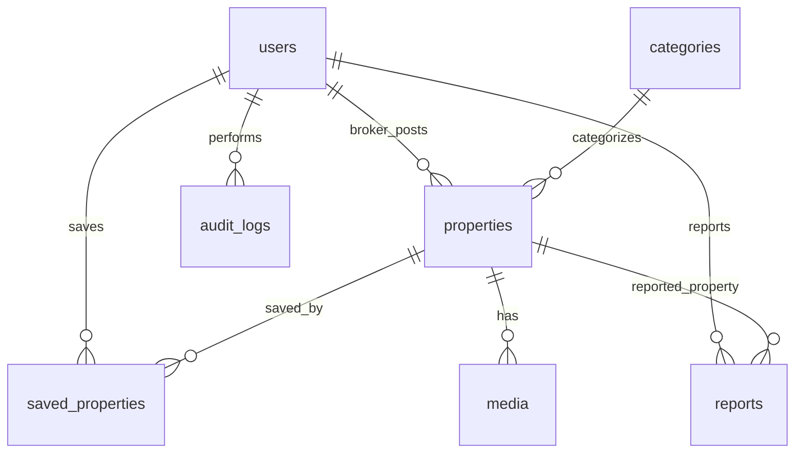

# Database Documentation

Database chính: PostgreSQL 16.

Migration source:

```text
backend-springboot/src/main/resources/db/migration
```

## Local Connection

Khi chạy `docker compose up --build`, PostgreSQL được publish ra host để DBeaver kết nối.

### DBeaver

DBeaver là công cụ khuyến nghị để quản lý database hằng ngày trên máy developer.

| Field | Giá trị mặc định |
| --- | --- |
| Driver | PostgreSQL |
| Host | `localhost` |
| Port | `${POSTGRES_PORT:-5432}` |
| Database | `${POSTGRES_DB:-travinh_realty}` |
| Username | `${POSTGRES_USER:-travinh_app}` |
| Password | `${POSTGRES_PASSWORD}` |

Lưu ý:

- Không commit connection profile có password thật.
- Không chạy câu lệnh destructive trên database staging/prod nếu chưa backup.
- Schema production phải thay đổi qua Flyway migration, không sửa tay.

### pgAdmin 4

pgAdmin 4 chạy trong Docker tại:

```text
http://localhost:${PGADMIN_PORT:-5050}
```

Thông tin đăng nhập lấy từ `.env`:

```text
PGADMIN_DEFAULT_EMAIL
PGADMIN_DEFAULT_PASSWORD
```

Khi add server trong pgAdmin, dùng host nội bộ Docker:

| Field | Giá trị |
| --- | --- |
| Host name/address | `postgres` |
| Port | `5432` |
| Maintenance database | `${POSTGRES_DB}` |
| Username | `${POSTGRES_USER}` |
| Password | `${POSTGRES_PASSWORD}` |

## Logical Schema

Các nhóm bảng chính:

| Nhóm | Bảng | Mục đích |
| --- | --- | --- |
| User/Auth | `users`, `saved_properties` | Tài khoản, phân quyền, trạng thái user và tin đã lưu. |
| Property | `categories`, `properties` | Danh mục và tin bất động sản. |
| Media | `media` | Hình ảnh, video file, video link của tin đăng. |
| Admin/Audit | `reports`, `audit_logs` | Báo cáo vi phạm và lịch sử hành động quản trị. |

## Relationship Overview



## JSONB Attributes

Bảng `properties` có cột `attributes` dạng JSONB để lưu thuộc tính động theo loại bất động sản.

Ví dụ:

```json
{
  "bedrooms": 3,
  "bathrooms": 2,
  "area": 120,
  "legalStatus": "pink_book"
}
```

Quy tắc:

- Key chỉ nên dùng chữ, số, `_`, `-`, `.`.
- Field phổ biến nên được chuẩn hóa trong API docs để frontend filter nhất quán.
- Field cần query nhiều nên cân nhắc index JSONB hoặc tách thành cột riêng.

## Migration Rules

- Mọi thay đổi schema phải tạo file `V{n}__description.sql`.
- Không dùng `hibernate.hbm2ddl.auto=update` ở production.
- Migration phải chạy được từ database rỗng.
- Migration destructive phải có kế hoạch rollback/backup.
