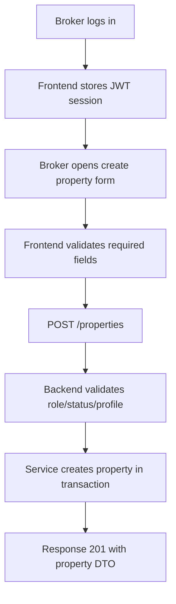
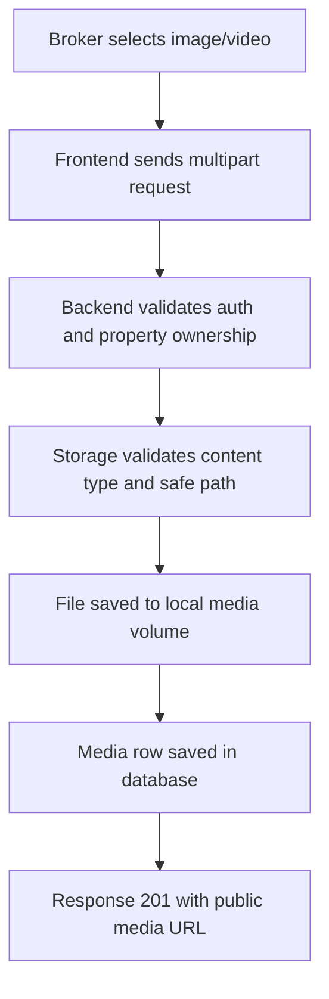
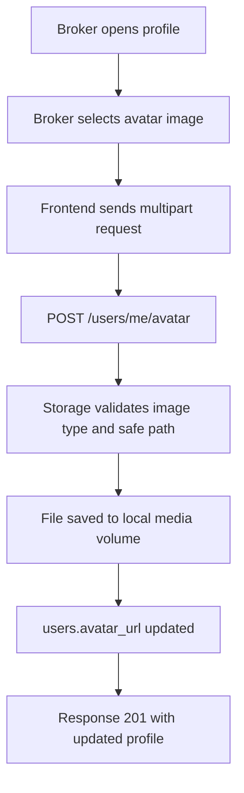
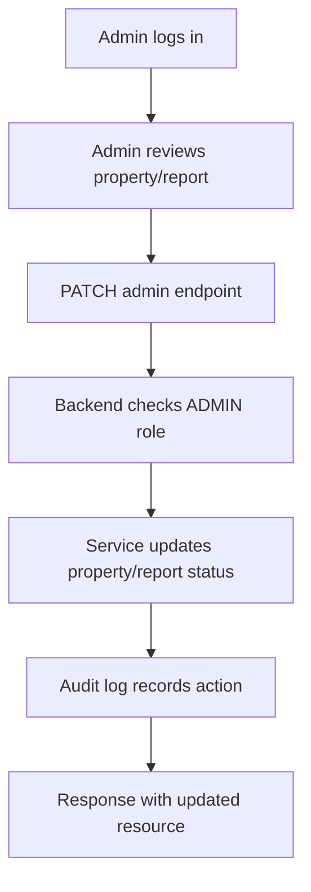

# System Flows

## Broker Creates Property

```mermaid
flowchart TD
    A["Broker logs in"] --> B["Frontend stores JWT session"]
    B --> C["Broker opens create property form"]
    C --> D["Frontend validates required fields"]
    D --> E["POST /properties"]
    E --> F["Backend validates role/status/profile"]
    F --> G["Service creates property in transaction"]
    G --> H["Response 201 with property DTO"]
```

## Upload Property Media

```mermaid
flowchart TD
    A["Broker selects image/video"] --> B["Frontend sends multipart request"]
    B --> C["Backend validates auth and property ownership"]
    C --> D["Storage validates content type and safe path"]
    D --> E["File saved to local media volume"]
    E --> F["Media row saved in database"]
    F --> G["Response 201 with public media URL"]
```

## Broker Uploads Avatar

```mermaid
flowchart TD
    A["Broker opens profile"] --> B["Broker selects avatar image"]
    B --> C["Frontend sends multipart request"]
    C --> D["POST /users/me/avatar"]
    D --> E["Storage validates image type and safe path"]
    E --> F["File saved to local media volume"]
    F --> G["users.avatar_url updated"]
    G --> H["Response 201 with updated profile"]
```

## Admin Moderates Property

```mermaid
flowchart TD
    A["Admin logs in"] --> B["Admin reviews property/report"]
    B --> C["PATCH admin endpoint"]
    C --> D["Backend checks ADMIN role"]
    D --> E["Service updates property/report status"]
    E --> F["Audit log records action"]
    F --> G["Response with updated resource"]
```
